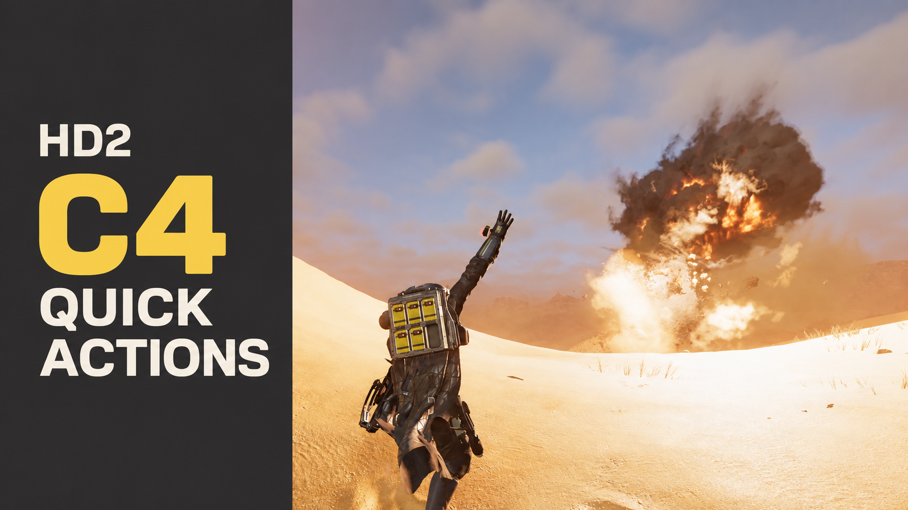

# HD2 C4 Quick Actions

[繁體中文](README.zh-TW.md)

Independent C4 deployment and detonation controls for **Helldivers 2**, with automatic activation for mouse and controller.

| Input | Deploy C4 | Detonate C4 |
| --- | --- | --- |
| Mouse | Right button | Left button |
| Xbox controller | LT | RT |
| PlayStation controller | L2 | R2 |

Equip your C4, release both mouse buttons and triggers, then use the controls above. **No F6 activation is required.** R keeps the game's reload behavior; after reloading you can continue using the mapping. Switching weapons restores normal firing controls.

## Install

1. Close the game.
2. Install [Bingus Shared Loader](https://github.com/CowboyBingus/BingusSharedLoader) **v15+ / API 1**, if it is not already installed.
3. Import [HD2-C4-Quick-Actions-v0.6.0.zip](dist/HD2-C4-Quick-Actions-v0.6.0.zip) into your mod manager, enable the mod and loader, then deploy.
4. Replace earlier C4 research versions (EXP01–EXP06); keep only one C4 version enabled.

The ZIP in `dist/` is the installable mod. A GitHub source-code ZIP is the development repository. The loader remains a separate dependency. For removal, disable this mod and redeploy with your manager.

## Behavior

- Actions are independent of the selected C4 firing mode.
- Holding a button does not repeatedly request actions. Simultaneous deploy and detonate inputs give detonate priority.
- Native reload timing and action eligibility still apply. This mod does not shorten animations or add a reload pre-trigger feature.
- Reload/menu keys, loss of focus and visible UI cursors temporarily suspend custom actions. Release the controls before resuming; paused pending actions are discarded.
- Controller triggers activate at 55% travel and release at 25%; activation baselines require both triggers below 10%.
- Original Aim behavior is retained. The mod shares one action lock across mouse and controller.

## Compatibility and validation

**Tested game build: `24826606`.** The runtime checks the game module hash and reviewed native signatures before taking control. Other builds require revalidation.

The tester reported normal mouse and Xbox operation, including the automatic version. Its latest recorded session contains **31 Deploy and 52 Detonate calls, all with observed native completion, with no recorded action faults or feature disarm**. Offline checks cover Xbox and PlayStation profiles, but **PlayStation hardware has not been tested**. Controller support depends on the device/profile exposed by the game; this is not a claim that every model or connection method works.

The implementation retains a conservative local, grounded-player scope. Multiplayer host/client, movement interruptions and every possible UI state are not fully validated. Window focus/cursor signals do not identify every cursorless menu. See the [validation record](docs/VALIDATION.md) for the exact scope.

## Source and development

The repository includes the complete Lua runtime, assembly and packaging scripts, tests, native-layout verification data, historical research notes and sanitized runtime traces.

```bash
python -B scripts/check_automatic.py
python -B scripts/build.py --loader /path/to/BingusSharedLoader
```

Python 3.10+ and LuaJIT are required for development. The build helper is pinned in [dependencies.lock.json](dependencies.lock.json). See [building](docs/BUILDING.md), [architecture](docs/ARCHITECTURE.md) and [research](research/README.md).

The public release preserves the exact tested EXP06 Lua payload. Historical `EXP06`, `C4DualInput` and `c4_boundary_probe` identifiers remain internally for evidence continuity and upgrades; the mod manager displays **HD2 C4 Quick Actions**.

## License and credits

Project-authored code and documentation are available under the [MIT License](LICENSE). External dependencies and game material retain their own terms; see [third-party references](THIRD_PARTY.md).

Research, implementation, tests and documentation were developed with AI assistance. Runtime observations, mock checks and user confirmations are identified separately throughout the evidence.
