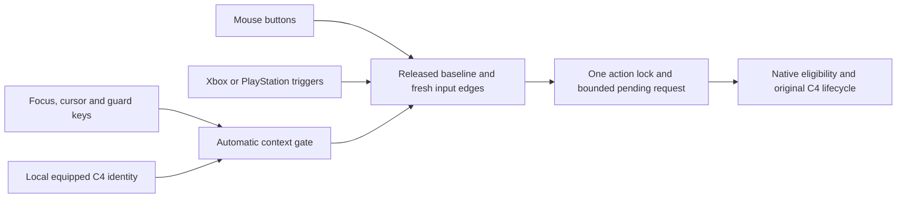

# Runtime architecture

The mod handles the equipped, locally owned C4 using the game's original action lifecycle. Deploy uses ability **521**; Detonate uses **520**. The input mapping does not change the selected firing mode.

## Context and native calls

`context_reader.lua` identifies the local mission/avatar, owned equipped C4 entity and descriptors. `action_reader.lua` checks its native weapon, ammo/chamber, action and conservative grounded-player state. Both firing-mode values are supported; unsupported state prevents a custom action.

The only bound native calls in this build are at RVAs `0x7c21a0`, `0x73ca00`, `0x73bf20` and `0x74b220`. Deploy follows original start/consume/count/after behavior; Detonate follows the original start path. The game handles the resulting animation, effects and network action. The mod does not directly spawn charges or explosions.

The runtime verifies the game module SHA-256 and 34 reviewed native signatures before acquiring the gate and before actions. These assumptions are specific to game build `24826606`, not portable offsets for arbitrary updates.

## Original Fire ownership

To avoid processing the same click twice, `weapon_fire_gate.lua` temporarily clears the original C4 Fire dispatch bit on the exact local weapon instance. The sole memory-write site in `fire_gate_windows.lua` exchanges the second flag byte for `0x1148 ↔ 0x148`. It compares and reads back the flags. Aim behavior remains original.

Weapon changes, pauses, shutdown and failures restore the saved C4 through a fresh entity/component lookup, rather than an old pointer. A held Fire input delays restoration on the same C4 until release to avoid replaying it as a vanilla action. Disappeared/reused entities and unexpected flags are not overwritten.

## Inputs and automatic activation

Mouse and engine Pad/PS4Pad input feed one edge router. Controllers use verified button names, with 55% activation / 25% release hysteresis and a 10% baseline requirement. One active device is selected; duplicate native/Steam Input representations do not create separate action paths. Unsupported device profiles retain original input behavior.

The router accepts fresh presses after a fully released baseline. Simultaneous requests prefer Detonate. An action lock observes native active/inactive lifecycle changes; at most one pending request is kept within its original 1.5-second deadline. Reload waiting follows the existing implementation; a new pre-trigger feature was explicitly out of scope.

Automatic mode starts with the mod. R and other guard keys pause input instead of permanently clearing the enable state. OS foreground ownership and read-only engine focus/cursor signals are checked before and after the original update. Pauses clear pending and input baselines; normal operation resumes after release. `mouse_focus` is logged rather than required so controllers can operate without mouse capture.

These signals are not a complete UI state machine. Cursorless menus remain a validation boundary. Missing or invalid window state prevents custom takeover and records the reason.

## Failures and diagnostics

Memory/code verification, logging and original-callback failures stop new custom actions and attempt Fire restoration. The automatic mode does not restart a latched fault. Callback return values and original exceptions are preserved.

Four rotating logs retain at most four 4 MiB segments. `capture_enabled` indicates that automatic mode is running; `fire_gate_active` indicates current C4 ownership; `gameplay_guard.runtime_state` records a transient pause reason. F7 adds a marker, while F6 has no effect in this version.

See the [historical native research](../research/docs/NATIVE_EXP03.md), [Fire routing analysis](../research/docs/NATIVE_EXP04.md) and [validation](VALIDATION.md).
