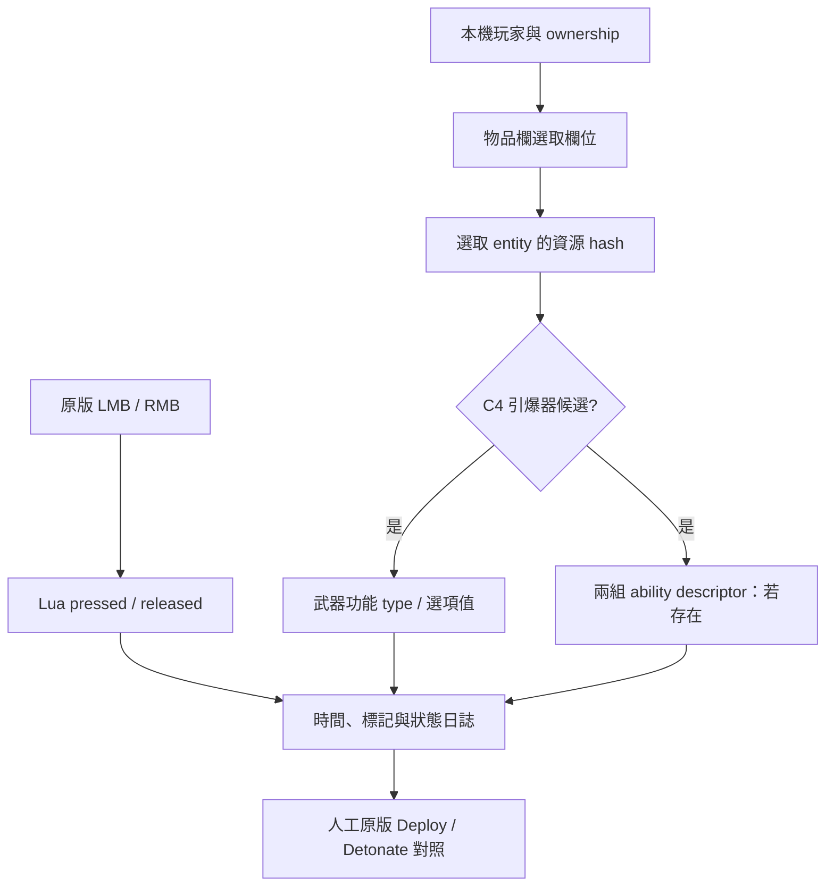

> Historical research note. Status statements describe that experiment; see [current validation](../../docs/VALIDATION.md). Local-only artifacts are not bundled.

# EXP02：原生邊界與裝備／模式觀測

2026-09-20。以下保留 EXP02 封裝時的離線研究紀錄。**後續 EXP02 實機資料已收到**，更新結果見 [LIVE_CONTEXT_RESULT](LIVE_CONTEXT_RESULT.md)；已進入 [EXP03 測試鍵原型](NATIVE_EXP03.md)。本頁表格中的「尚未確認」描述的是封裝當時的證據範圍。

## 實際進展

第一輪已證明 LMB／RMB 的按下與放開可分別取得。第二輪沿用相同輸入觀測，新增本機玩家、目前選取武器及武器功能值，避免再次只收集滑鼠資料。

已找出同一 build 的 C4 資源處理分支，以及共用 ability dispatch。C4 相關分支尚不能當成完整的投擲 API：其中一條會直接進入物件建立與投擲處理；跳過上層可能漏掉原本的動作生命週期、消耗或同步。

目前 Deploy／Detonate 可否獨立呼叫仍是 **UNRESOLVED**。沒有轉入 Route C，也沒有把資料 getter、元件名稱或 dispatcher 整數誤列為已驗證 Action ID。

## 證據來源

- 既有唯讀原生快照：`<local-home>/hd2-spawn-inspector/state/r1/sessions/20260918T004659Z-324-8013894`。擷取於 2026-09-18，build `24826606`，只含非 writable 區段；沒有當時的堆積與武器狀態。
- 快照標記的 `game.dll` SHA256 與現在磁碟檔相符：`cc75948d90fdfde259dcb519e9933db7ffa3ccb281ce4fb89e6b1b011557470c`。區段和讀取工具指紋見 native-exp02-inputs.json (`../evidence/native-exp02-inputs.json`; local research artifact)。
- 玩家定位參考 [CowboyBingus/ConsistentVaulting 固定提交](https://github.com/CowboyBingus/ConsistentVaulting/tree/57b6b277373d6192d612396815c283ab17e6f2cc)。只用於核對結構與 ownership 邏輯；本實驗未執行該 Mod 或其原生函式。
- RawData 的 InventoryComponentData 仍是 2026-07-07 舊版靜態配置，不是本次的動態物品欄證據。

## 原生追蹤結果

以下皆為 game.dll RVA；符號名称是本研究描述，非官方匯出符號。

| 位置 | 從指令得到的結果 | 限制 |
| --- | --- | --- |
| `0x99d220` → `0x9a5ac0` | 物品欄依 entity ID 找 index，讀取 48-byte state 的 `+0x1c` 選取欄位，再按 switch 取物件 ID | 「目前手持」意義需用換武器實測確認 |
| `0xd3e8d0` | entity ID map → 24-byte entity record，前 8 bytes 為資源 hash | 不可只看資源存在；要與選取欄位及 ownership 一致 |
| `0x7556a0`、`0x53a510` | WeaponData manager 的 entity map、registry、`0x3e0` state 和 12-byte packed state | 各欄位名稱不可由舊 dump 直接套用 |
| `0x74da00` | 依武器功能 type 讀選項值；部分 type 位於 packed word `+4` 的 2-bit field | 探針記數值，不先命名 Deploy／Detonate |
| `0x7cd240` → `0x508be0` | AbilityWeapon 的模板含兩個 40-byte descriptor，選擇器再取其中一個 | 尚未確認目前 C4 是否具有此元件與此模板 |
| `0x7cd310` → `0x7c21a0` | 原版 ability weapon driver 會用 descriptor 進入 ability 管理流程，涉及 owner、狀態檢查及其他副作用 | 不能只取某個 dispatcher 分支當完整 action |
| `0xeb4510` | 共用分派表，整數 `521` 對應 `0xe1fd90`，`2265` 對應 `0xe79e50` | 分派表索引不是已驗證 Deploy／Detonate ID |
| `0xe1fd90` | 分支引用 C4 charge hash `9b75217d8312dd67`，再呼叫 `0xf2a340` | 事件參數與生命週期未解完；不呼叫 |
| `0xe79e50` → `0x9dac30` | ownership 檢查後進入 RemoteTrigger 元件流程 | 未證明這就是 C4 背包引爆；不呼叫 |
| `0x12c4754` | 註冊 `RemoteExplosives` 字串為列舉值 `0x54` | 列舉註冊，非引爆函式 |

`0x7cd160` 在本版查詢功能 type `10`；歷史 RawData 的 `WeaponFunctionType_Detonate` 為 `11`。因此不能在沒有當前 runtime 值的情況下把 AbilityWeapon 分支直接宣稱為 C4 雙模式實作。

交叉引用搜尋會對候選位置做 objdump 解碼與 unwind span 核對；這只是搜尋線索。Span 可能含 jump table 或 leaf 區段，實際解讀仍需核對控制流。`window-*.asm` 是明確標示的原始短窗口，不宣稱有 unwind 函式邊界。

## EXP02 觀測範圍



- 啟動先驗完整磁碟 game.dll SHA256 與六處 live code fingerprint。
- 用 ReadProcessMemory 複製小範圍資料；所有 map、index、單次讀取、每次 snapshot 都有上限。
- 讀完重新比對身份、map 與相關狀態；中途換武器或 storage 重用時捨棄結果。
- C4 在物品欄其他位置、非本機玩家、沒有選取武器都不會產生可用 C4 候選；死亡或過場資料失效時停止判讀。
- 20 Hz 取樣，F7 可強制取樣。輸入日誌帶 snapshot age，不能假裝每個滑鼠事件都同步讀到當幀武器資料。
- 沒有遊戲記憶體寫入、原生遊戲函式呼叫、Fire 模擬或 OS 輸入 hook。
- `c4_guard_candidate` 仍待實機換武器驗證；沒有授權任何 Action 的執行。

## 驗證與下一輪

22 項 synthetic memory／runtime 行為檢查、31 項原有輸入回歸、4 項組合 addon 的 Windows API／引擎 mock 整合檢查，加上 Lua 語法檢查，共 58 項通過。封裝再次驗證只有一個自有 Lua resource，內容與受測 source 相同。這不代表真實 Windows API、Proton 或 C4 遊戲流程已通過實測。

套件：C4-Context-Probe-EXP02.zip (`../dist/C4-Context-Probe-EXP02.zip`; local research artifact)。沿用 EXP01 的 resource 與 GUID，由 Mod Manager 取代舊版後重啟。完整步驟見 [EXP02 操作流程](CONTEXT_PROBE_README.txt)。本輪只需一次原版投擲／引爆及武器切換，無需再重複第一輪高速滑鼠測試。

資料就緒後執行：

```bash
python -B scripts/collect_context.py
```

核對六個 F7 標記，先驗裝備路徑，再比對 Deploy → Detonate → Deploy 的選項值與 descriptor；只有確認完整原版入口及參數，才進入 PRD 的 Test Key → Deploy／Detonate 原型。

重建：

```bash
python -B scripts/check_context.py
python -B scripts/build_probe.py --phase exp02
```
