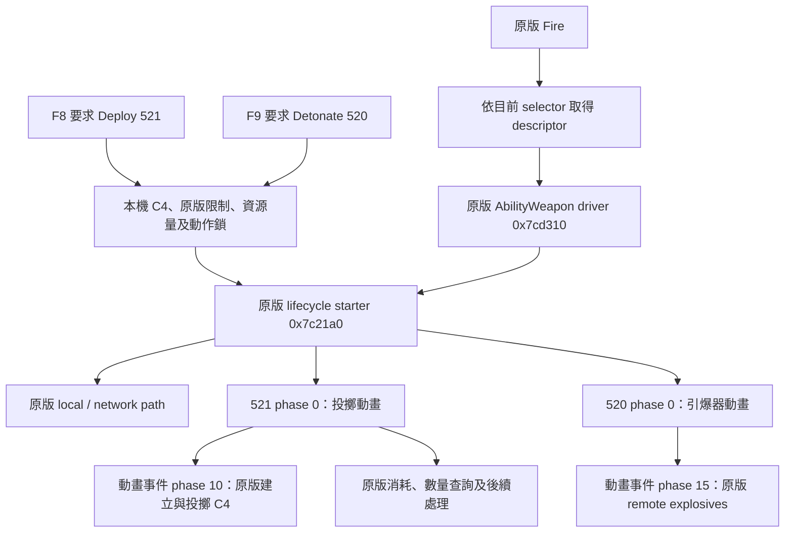

> Historical research note. Status statements describe that experiment; see [current validation](../../docs/VALIDATION.md). Local-only artifacts are not bundled.

# EXP03：原版 C4 動作的測試鍵原型

本輪交付 F8 → Deploy、F9 → Detonate 的可安裝原型。**EXP03.1 已實機觀察到 7 次 Deploy、2 次 Detonate，使用者回報成功；全程為 Deploy 模式，反向跨模式尚待驗收。** 最新修正版是 C4-Action-Prototype-EXP03.2.zip (`../dist/C4-Action-Prototype-EXP03.2.zip`; local research artifact)，實機結果與 pending 修正見 [最新紀錄](LIVE_ACTION_SUCCESS.md)，操作見 [測試流程](ACTION_PROTOTYPE_README.txt)。

EXP02 已確認目前選取的本機 C4 resource、兩個 ability descriptor 與 0 → 1 → 0 的模式資料，見 [實機結果](LIVE_CONTEXT_RESULT.md)。以下以同一 build `24826606` 的原生程式與這份 runtime 配置共同推導；RVA 名稱均為本研究描述，非官方匯出符號。

## 原版邊界



選擇器與兩個 action 是分開的；這支持 Route A 的結構可行性。跨模式時動畫、資源與結果是否完整，仍須實機驗證。

| 原生位置 | 依據與本原型用法 |
| --- | --- |
| `0x7cd240` → `0x7cd160` → `0x508be0` | selector 選兩個 40-byte descriptor。原型核對完整 80 bytes，直接選已確認的 action ID |
| `0x7cd310` | C4 owner/other action 都為 0，因此只須 weapon action 分支與 descriptor flag 32 的後續流程 |
| `0x7c21a0` | 呼叫 `(ability_manager, weapon_id, action_id, 1, 1.0f)`；完整原版生命週期與網路流程 |
| `0x211c5b0` | 原版 call site 載入的第五參數是 **1.0**，不是 0.0；已讀取該常數並加入指紋 |
| `0xeb4510` | jump-table index `ability_id-1`；520 → `0xe1fd10`，521 → `0xe1fd90` |
| `0xe1fd90` | phase 0 啟動動畫；phase 10 引用 C4 charge `9b75217d8312dd67`；phase 31 完成。原型不直接呼叫 phase 10 |
| `0xe1fd10` | phase 0 啟動動畫；phase 15 沿 ownership 檢查進入 `0x763a20`，並回報完成。原型不直接呼叫 phase 15 |
| `0x73ca00` → `0x73bf20` → `0x74b220` | Deploy 啟動後依原版順序消耗、查數量、做原版後續處理；Detonate 的 descriptor 不要求這組消耗 |

原版 `0x7c21a0` 若在 active 狀態重入會清理／替换舊 action。PRD 要求避免重複引爆，因此新原型額外要求 active 為 0，再以原版 active → inactive 觀察結束，絕不寫入 active 或強制完成。

## 不受目前 selector 影響的原版限制

`0x73ce40` 的前提是 Weapon component 存在、`0x91c940` 不阻擋、`0x76f3d0` 不阻擋，並通過 ammo 與 weapon-kind gate。

ammo gate `0x73cf80` 會依**目前 selector** 的 descriptor flag 32 決定是否略過 ammo；不能直接照抄對另一個 action 的判斷。v0.3.0 僅接受 `flags & 0x799 == 0x408`，這個未經實機驗證的假設造成最後一輪全部拒絕。舊錯誤處理丟掉 flags，不能從該紀錄反推實際數值。

EXP03.1 先按 `0x73d210` 確認 AbilityWeapon 分支，再依 `0x73cf80` 原本優先順序辨識 ammo 系統：bit 7 Magazine → bit 8 Rounds → bit 10 Resource → bit 9 Heat。本版實作 Rounds 與 Resource；其餘分支保留完整 flags、stage、error 後拒絕，沒有略過原版前提。Deploy 使用所要求動作的 ammo 條件；Detonate 不要求 Deploy ammo ready。

WeaponRounds 使用 manager `0x276ca00`、map +`0x28`、registry +`0x40`，state +`0x50` stride 24、runtime +`0x58` stride 20。effective config 依 `0x4f7ff0` 優先查 entity override（map +`0x68`、config +`0xa8` stride `0x84`），否則依 `0x4f7bc0` 查 owner +`0xf113a8` 的 46-entry resource table；hash modulo 46 用完整 uint64 值。

- config +`0x68` 非零：runtime +`0x10` 必須為零，state +`0x10` 的 chamber token 必須非零。
- config +`0x68` 為零：runtime +`4` 選第 0/1 組 magazine，state +`4 + index*4` 必須是 signed positive。
- `ammo_available` 在 Rounds 分支只記 selected magazine count，不代表背包數量或 chamber。允許 Deploy 使用獨立布林 `deploy_ammo_ready`，因此「magazine 0、chamber ready」仍可沿原版流程投最後一發。
- Resource 分支維持 `0x76a1e0` 原版 provider 計數／布林條件。

`0x73bf20` 還會計入已部署 C4，所以不能把它作為允許再次投擲的條件。它只用於原版消耗後流程。`0x73d210` 在這個經核對的 C4 weapon-kind 分支轉到 `0x7cd840`，後者對本 C4 resource 僅要求 AbilityWeapon component 存在；特殊武器 hash `557ea199f0713919` 的分支不适用。

這些欄位讀取均有界限、entity registry 比對與前後一致性檢查。EXP03.1 實機已確認 flags `0x1148`、Rounds template、magazine count 0、chamber token 就緒時為 55，且兩個原生 action 可完成。extension 失敗時仍重查已讀資料的一致性；只保留診斷，不發出動作 capability，避免錯誤變成可執行狀態。

## 限定範圍

- 每次啟動與每次 action 呼叫前核對 28 處、共 9344 bytes 程式／常數，並核對磁碟 game.dll SHA256。不同 build 或被改動的入口不繼續。
- 只呼叫四個原版函式，ABI 與指紋在 [action-layout.json](../../evidence/action-layout.json)。沒有直接記憶體寫入、mode setter、Fire 注入、raw spawn/explosion、OS 輸入 hook。
- 需 F6 啟用、角色持有本機 C4、按鍵由放開到 pressed；F8/F9 長按不重複。測試鍵同 callback 時拒絕兩者，正式雙滑鼠優先級尚未制定。
- native action active 時最多一格 pending，先到者保留，同種請求合併，1.5 秒過期。EXP03.2 在 active 結束但 chamber 尚未就緒時繼續保留 queued Deploy，不重設期限。換武器、失焦、資料失效、原版滑鼠輸入或停用時丟棄 pending。
- 8 秒仍未觀察結束時停止新呼叫，不把 timeout 當成完成，不取消原版 action。
- 額外採用本版 ConsistentVaulting 參考程式 (`../references/ConsistentVaulting/src/vault_data.lua`; local research artifact) 的保守角色旗標作為實驗 veto，先限於地面狀態。這不是完整 C4 姿勢允許表，且不能用這版拒絕某姿勢就判定 Route A 不可行。
- GetForegroundWindow 只檢查視窗所屬程序，不取得或合成 OS 輸入。常用選單／模式鍵會停用測試；自訂按鍵、所有 UI、所有姿勢留待後續。
- 仍保留原版滑鼠行為，因此目前不能接上正式 RMB/LMB mapping；先完成 PRD Prototype A/B 的畫面驗證。

## 驗證與證據邊界

離線檢查涵蓋 synthetic memory、跨模式參數與扣彈順序、零彈、busy/timeout、pending 合併、identity 變動、焦點與 UI、30/60/144 Hz 長按、日誌寫入／flush／上限失敗，以及舊 EXP01/02 回歸。完整結果見 action-offline-tests.json (`../evidence/action-offline-tests.json`; local research artifact)。Windows API、native ABI 與遊戲行為仍需在實機驗證。

日誌區分 `CALL_BEGIN`、`NATIVE_CALL_RETURNED`、`NATIVE_ACTIVE_OBSERVED`、`NATIVE_LIFECYCLE_ENDED`，不寫假 `SUCCESS`。collector 以最後有 F8/F9 或 action 活動的 session/capture 為主，列出略過的新啟動紀錄，保留底層 context error。計算的 ammo 差值標出 counter 來源與語義，不能宣稱已驗證背包消耗。

重建與收集：

```bash
python -B scripts/derive_actions.py
python -B scripts/check_actions.py
python -B scripts/build_probe.py --phase exp03
python -B scripts/collect_actions.py
```

下一個判定點：F8 在 Detonate 模式能實際投擲並扣一顆；F9 在 Deploy 模式能實際引爆，兩者 HUD 模式保持不變。通過後才研究原 Fire/Aim 消重與 RMB/LMB mapping，再做完整壓力、狀態及多人矩陣。
