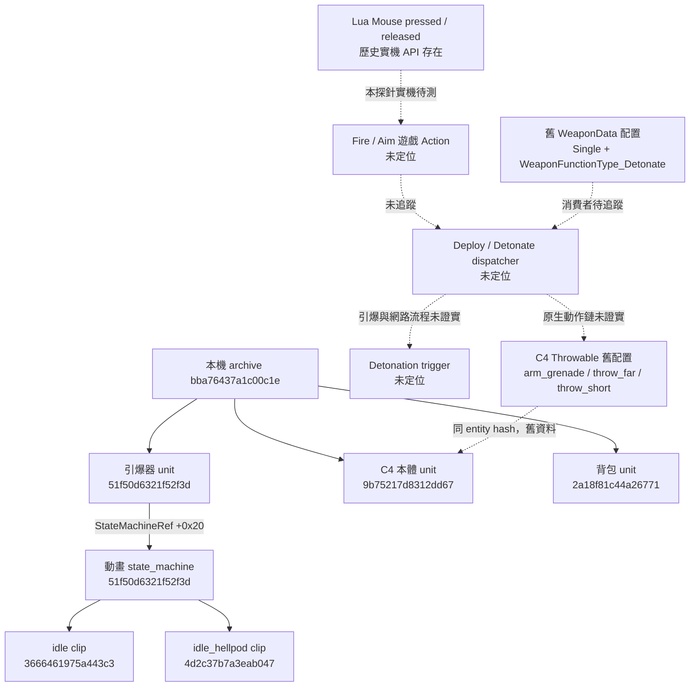

> Historical research note. Status statements describe that experiment; see [current validation](../../docs/VALIDATION.md). Local-only artifacts are not bundled.

# C4 資源關係與未確認邊界

實線：目前檔案中按格式解出的關係或 archive 成員。虛線：舊版配置或待追蹤的執行路徑。

| 類別 | resource ID（hex） | 名稱／用途 | 狀態 |
| --- | --- | --- | --- |
| 背包 | `2a18f81c44a26771` | `.../c4_charge_backpack` | 現版 unit／bones／physics 已找到 |
| 引爆器 | `51f50d6321f52f3d` | `.../c4_charge_detonator` | 現版 unit／bones／physics／state_machine 已找到 |
| C4 本體 | `9b75217d8312dd67` | `.../c4_charge` | 現版 unit／bones／physics 已找到；完整 spawn 路徑未證實 |
| Deploy UI | `38adabc6a32af014` | `content/ui/mission/hud/weapon_function/firemode_deploy_c4` | material／texture，**不是 Action** |
| Detonate UI | `55374383474193f8` | `content/ui/mission/hud/weapon_function/firemode_detonate_c4` | material／texture，**不是 Action** |
| Deploy Action ID | 未知 | 無可驗證的呼叫入口 | 待研究 |
| Detonate Action ID | 未知 | `11 / WeaponFunctionType_Detonate` 不能替代它 | 待研究 |
| Gameplay state machine | 未知 | 不等於已找到的動畫 state machine | 待研究 |

完整路徑、來源 archive、byte offset 與 SHA256 見 local-resources.json (`../evidence/local-resources.json`; local research artifact) 和 state-machine.json (`../evidence/state-machine.json`; local research artifact)。所有 64-bit 資源 ID 用字串保存，避免 JSON／JavaScript 精度遺失。
